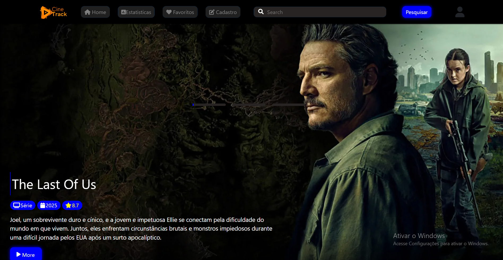
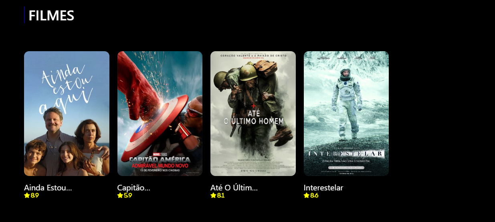
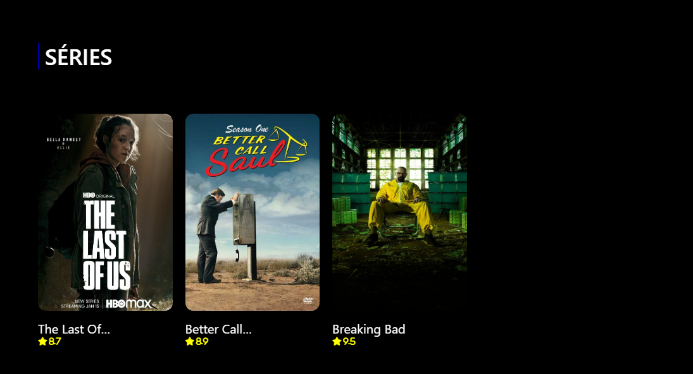
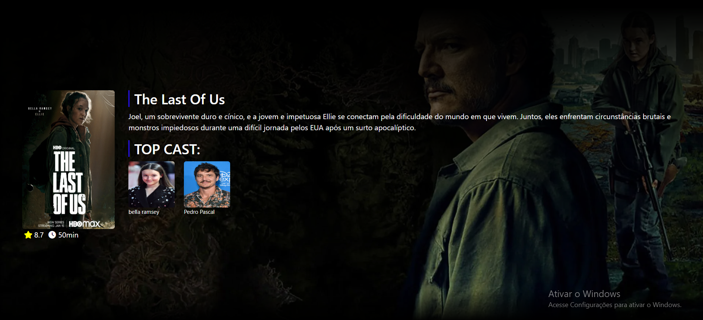
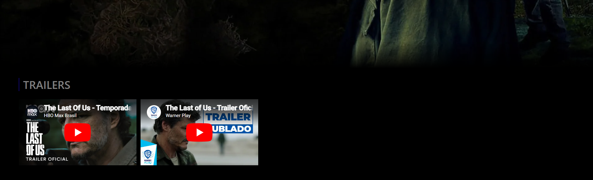

# 🎬 CineTrack

> Projeto web de catálogo de filmes desenvolvido no 1º semestre do curso de Sistemas de Informação.

---

## 📖 Sobre o projeto

O **CineTrack** é uma aplicação web criada com o objetivo de representar um catálogo de filmes funcional, permitindo organização, exibição e visualização de informações de maneira intuitiva.

O projeto foi desenvolvido como trabalho acadêmico, focando na aplicação prática de conceitos de desenvolvimento web, estruturação de interfaces e manipulação de dados.

Além da versão original, este repositório também servirá para futuras refatorações e melhorias no sistema.

---

## ⚠️ Observações sobre o projeto

Este projeto foi desenvolvido no início da graduação, durante o 1º semestre do curso, então possui uma estrutura mais simples e acadêmica.

Algumas características da implementação atual:

- Utilização de HTML, CSS e JavaScript puro
- Grande parte da estilização feita manualmente com CSS
- Uso de `localStorage` e `sessionStorage` para persistência temporária de dados
- Simulação de API utilizando `json-server`
- Banco de dados mockado através do arquivo `db.json`
- Estrutura de pastas e organização do código ainda não ideal
- Ausência de componentização e arquitetura escalável
- Código desenvolvido com foco em aprendizado e prática dos conceitos fundamentais

O objetivo deste repositório também é acompanhar a evolução do projeto através de futuras refatorações, melhorias de arquitetura, modernização do front-end e aprimoramento do back-end.

## 🚀 Objetivos do projeto

- Desenvolver uma aplicação web funcional
- Trabalhar conceitos de front-end e back-end
- Organizar e exibir dados de filmes
- Criar uma interface intuitiva e visualmente agradável
- Aplicar lógica de programação na manipulação dos dados

---

## 🛠️ Tecnologias utilizadas

As tecnologias utilizadas na versão atual do projeto incluem:

- HTML5
- CSS3
- JavaScript
- Bootstrap

Possíveis tecnologias futuras:

- Vue.js
- Express
- MongoDB
- APIs externas de filmes
- Chart.js
- FullCalendar
- Zod
- ...

---

## 📈 Futuras melhorias

O projeto será refatorado futuramente com foco em:

- Melhor estruturação do código
- Interface mais moderna
- Responsividade aprimorada
- Integração com APIs de filmes
- Sistema de autenticação
- Banco de dados real
- Melhorias no desempenho
- Componentização do front-end
- Arquitetura mais escalável

---

## 📷 Prints da aplicação

### Tela inicial


### Catálogo de filmes


### Catálogo de Séries


### Página de detalhes





---

## ⚙️ Como rodar a aplicação

Clone o repositório:

```bash
git clone https://github.com/seu-usuario/cinetrack.git
